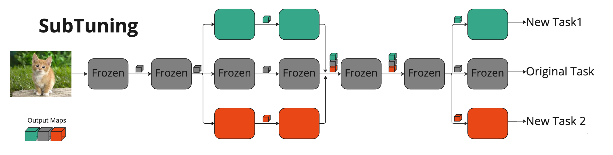

# SubTuning: Efficient Finetuning for Multi-Task Learning

[[Paper]](https://arxiv.org/abs/2302.06354)

SubTuning (Subset Finetuning) is a simple and efficient method for multi-task learning that allows for the deployment of new tasks at minimal computational cost. With SubTuning, different tasks do not interfere with one another and yet share most of the resources at inference time. This method is demonstrated to achieve accuracy comparable to full finetuning of the model, and even surpasses the performance of full finetuning when training data is scarce.
## Approach


## Usage
To run experiments, follow these steps:

1. Clone the repository.
2. Build and run the Docker container by running the following commands:
```
cd docker
docker build -t subtuningimage .
docker run --rm -it subtuningimage
```
3. insert your WandB entity, API key, and project name in the wandb.text file located in the project directory.

4.  run experiments using the provided bash scripts. The hyperparameters in the bash scripts can be modified. For instance, by changing the value of _model.layers_to_finetune_ in the _run_active_learning.sh_ bash script, you can choose the layers to fine-tune.
For example, to create a finetune profile for ResNet50, run the following command:
```
bash scripts/run_finetune_profile_resnet50.sh
```
If you have any issues or questions, please create a git issue.

## Citation
```
@misc{https://doi.org/10.48550/arxiv.2302.06354,
  doi = {10.48550/ARXIV.2302.06354},
  url = {https://arxiv.org/abs/2302.06354},
  author = {Kaplun, Gal and Gurevich, Andrey and Swisa, Tal and David, Mazor and Shalev-Shwartz, Shai and Malach, Eran},
  keywords = {Machine Learning (cs.LG), Artificial Intelligence (cs.AI), FOS: Computer and information sciences, FOS: Computer and information sciences},
  title = {SubTuning: Efficient Finetuning for Multi-Task Learning},
  publisher = {arXiv},
  year = {2023},
  copyright = {Creative Commons Attribution Non Commercial No Derivatives 4.0 International}
}
```